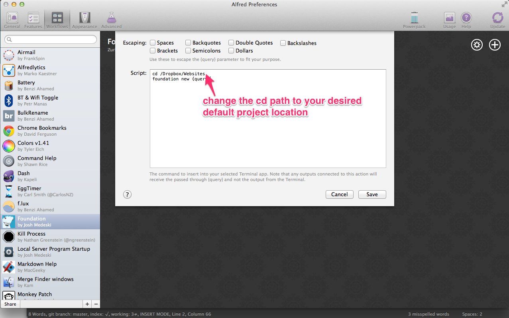

## Foundation

This is a simple [Alfred](http://www.alfredapp.com/) workflow that allows you to quickly create and update [Foundation]((http://foundation.zurb.com/)) projects.

Learn more about Foundation and get it installed on your computer [visit the docs](http://foundation.zurb.com/docs/sass.html).

### Installation

1. Click on "foundation.alfredworkflow"
2. Click on "Raw" (this will download the alfred workflow file)
3. Double click the downloaded "foundation.alfredworkflow" on your computer, it will prompt you to install the Workflow into Alfred.
4. Change the default path of new projects by editing the new project cd path in the workflow setting.

### Usage
To use this workflow. Type in "foundation your-project". Replace your-project with the title of your project (which will result in the folder's name upon project creation). To update an existing project type "foundation update your-project" and choose the folder you are wishing to update. Alfred will do the rest!

### Questions or Comments?
Send me a message on twitter: [**@joshmedeski**](https://twitter.com/joshmedeski)

### Change Log

#### November 21, 2013
- Updated to Foundation 5!