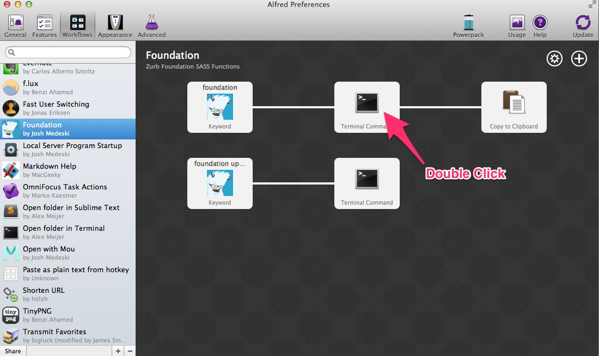
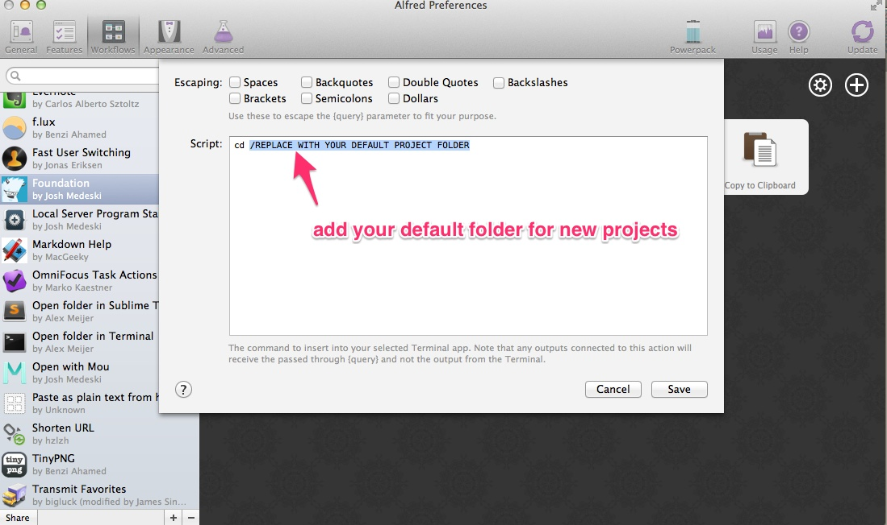

## Foundation for Alfred

This is a simple [Alfred](http://www.alfredapp.com/) workflow that allows you to quickly create a compass/sass project with [Zurb's Foundation](http://foundation.zurb.com/).

[Learn more about Sass+Foundation](http://foundation.zurb.com/docs/sass.html)

### Installation

1. Download the zip. Extract and double click "foundation.alfredworkflow"

2. Change the default project folder in the first terminal command.

 

### Instructions
To use this workflow. Type in "foundation your-project". Replace your-project with the title of your project (which will result in the folder's name upon project creation).

### Update Foundation
Just type "foundation update" and the terminal will run and update your gem to the latest version :)

### Questions or Comments?
Send me a message on twitter: [**@joshmedeski**](https://twitter.com/joshmedeski)
